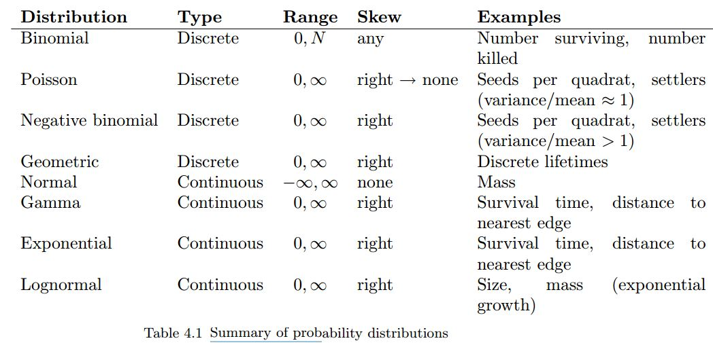

```{r include=FALSE}
library(dplyr)
library(ggplot2)
theme_set(theme_bw())
library(ggfortify)
```

## Probability Distributions in R

### Objectives:

* Become familiar with common probability distributions in R
* Understand how probability distributions are related to each other

#### Summarizing Data

**Expectation**

If the random variable $x$ can take values $x_1,...,x_N$ with equal probability, the expected value $E[x]$ of $x$ is defined to be:

$$E[x]=\sum_{i=1}^N\frac{x_i}{N}$$
Properties of the expected value:
* $E[x+y]=E[x]+E[y]$
* $E[cx]=cE[x]$

**Variance**

The variance of the random variable $x$ is defined to be:

$$Var[x]=E[(x-\bar{x})^2]=E[x^2]-(\bar{x})^2$$

The standard deviation is easier to interpret than $Var$ because it is in the same scale as the mean. It is defined by:

$$\textrm{SD}=\sqrt{Var[x]}$$

The relative standard deviation or coefficient of variation is defined by:
$$\textrm{CV}=\textrm{SD}/\bar{x}$$

This quantity is useful because it is scale independent.

**Higher Moments**

Skew: are the data symmetric about the mean?

$$\textrm{Skew}=(x-E[x])^2$$

Kurtosis: how 'pointy' are the data?

$$Kurt[x]=E[(x-E[x])^4]$$


## Probability distributions

see also [CRAN Distributions Task View](https://cran.r-project.org/web/views/Distributions.html)


from  [Aswath Damodaran](http://people.stern.nyu.edu/adamodar/pdfiles/papers/probabilistic.pdf)


### Discrete probability distributions

#### Poisson

* Describes number of events in a given amount of time / or number of individuals expected in a given area
* Parameter $\lambda$ is average density or arrival rate
* As $\lambda \rightarrow \infty$, $Poisson(\lambda)\rightarrow N(\lambda, \sqrt{\lambda})$

#### Binomial

* Number of successes in $n$ independent experiments
* Parameters:
   - $n$ = number of trials
   - $p$ = probability of success
   - pdf: $p^x(1-p)^{N-x}$

Let's flip a coin:

```{r}
ifelse(rbinom(100, 1, 0.5), "H", "T")
```

### Continuous probability distributions

#### Uniform

* $Uniform(a,b)$ defines equal probability over the range $[a,b]$
* Often used as prior distribution in a Bayesian framework to indicate that 'nothing is known'. However:
  + usually it is not true that nothing is known, or that $P(event) = \frac{1}{(b-a)}$ over range $[a,b]$ but $P= 0$ elsewhere.
  + the fact that $U(a,b)$ indicates that 'nothing is known' is scale dependent.
  + good for quick and dirty priors, but not much else

#### Normal

Ubiquitous because of the Central Limit Theorem: "a large number of independent samples from the same distribution, the distribution of the sum will be approximately normal"

$$x\sim N(\mu,s)$$
Here is a short example of the Central Limit Theorem, sampling from the gamma distribution (see below):

```{r}
samps <- matrix(data = rgamma(10000, 5, 2), nrow = 1000)
#samps <- matrix(data = rbeta(10000, 1, 2), nrow = 1000)
hist(rowMeans(samps), breaks = 20, main = 'Demonstration of Central Limit Thm')
```

Here is a short example of the Central Limit Theorem, sampling from the beta distribution (see below):

```{r}
samps <- matrix(data = rbeta(10000, 1, 2), nrow = 1000)
hist(rowMeans(samps), breaks = 20, main = 'Demonstration of Central Limit Thm')
```

#### Gamma

Distribution of waiting times until a certain number of events take place.

$$Gamma(shape, rate)$$

* parameters: waiting time for `shape` events given `rate`
* e.g. $Gamma(shape = 3, rate = 2)$ is time until three events if avg time to event is 2 per day
* mean = shape / rate = 1.5

```{r}
x <- seq(from = 0, to = 10, by = 0.1)
plot(x, dgamma(x, shape = 3, rate = 1/2), type = 'l')

```


Applications:
* any distribution where $x\in[0,\infty)$
* conjugate prior on $\sigma$, e.g. $x\sim N(\mu,\sigma); \sigma~Gamma(0.001,0.001)$ is a broad prior on $\sigma$

#### Exponential

* $Exp(\lambda)\equiv Gamma(1,\lambda)$


Applications:

* times between events, lifespans, survival times
* random samples of anything that decreases exponentially


#### logNormal

$$x\sim N(log(\mu),log(s))$$


### Mixture Models

```{r}
t <- 1:100/10
l <- sapply(t, function(x) rpois(1, 10*max(0, sin(x))))
plot(t, sin(t), ylim = c(-1, 15), type = 'l', col = 'red')
lines(t, l)

```


Table 4.1 from Bolker 2009


### R functions for Probability distribution


```{r}
help.search('distribution', package = 'stats')
?Binomial
```


Distribution | R name | Parameters
------------ | ------ | ----------
beta         | beta   | shape1, shape2, ncp
Binomial     | binom  | size, prob
Cauchy       | cauchy | location, scale
chi-squared  | chisq  | df, ncp
exponential  | exp    | rate
F            | f      | df1, df2, ncp
gamma        | gamma  | shape, scale
geometric    | geom   | prob
hypergeometric | hyper | m, n, k
log-normal   | lnorm  | meanlog, sdlog
logistic     | logis  | location, scale
Negative binomial | nbinom | size, prob
normal       | norm   | mean, sd
Poisson      | pois   | lambda
Student's t  | t      | df, ncp
uniform      | unif   | min, max
Weibull      | weibull | shape, scale
Wilcoxon     | wilcox | m, n


* "d" = density: probability density function (PDF)
* "p" = cumulative distribution function (CDF)
* "q" = compute quantiles: calculates the value associated with a specified tail probability, inverse of "p"
* “r” = simulates random numbers from the distribution

#### PDF functions `dnorm` etc

```{r}
x = seq(-5,5,by=0.1)
plot(x,dnorm(x),type='l')  		## that’s a lowercase “L” for “line”
#abline(v=0)					          ## add a line to indicate the mean (“v” is for “vertical”)
lines(x,dnorm(x,2),col=2)			## try changing the mean (“col” sets the color)
#abline(v=2,col=2)
lines(x,dnorm(x,-1,2),col=3)	## try changing the mean and standard dev
#abline(v=-1,col=3)
```


You will use density functions quite frequently to estimate the **likelihood** of data.  For example if we collected a data point of x = 0.5 we can calculate the likelihood that this data point came from each of these three normal distributions.  Implicit in the likelihood is that we're looking at the probability of the data in a very small window, $\delta x$, and that $\delta x$ never changes so that:

$$Pr(x < X < x + \delta x) = \int_{x}^{x + \delta x} f(x)dx \propto f(x)$$

```{r}
dnorm(0.5,0,1)
dnorm(0.5,2,1)
dnorm(0.5,-1,2)
```

This shows that the first distribution has a higher likelihood than the other two, which are about the same.  We interpret this as saying that the observed data point was more likely to have been generated by the first distribution than the other two.  This is consistent with where the dashed blue line intersects each of the curves.  

This plot of the normal distribution and the effects of varying the parameters in the normal are both probably familiar to you already – changing the mean changes where the distribution is centered while changing the standard deviation changes the spread of the distribution.

### CDF functions `qnorm` etc

Next try looking at the CDF of the normal:

```{r}
plot(x,pnorm(x,0,1),type='l')
abline(v=0)
lines(x,pnorm(x,2,1),col=2)
abline(v=2,col=2)
lines(x,pnorm(x,-1,2),col=3)
abline(v=-1,col=3)
```


Using the CDF we can calculate $Pr(X \leq x)$ for our data point

```{r}
pnorm(0.5,0,1)
pnorm(0.5,2,1)
pnorm(0.5,-1,2)
```

If the value 0.5 here corresponded to some hypothesis, the CDF could be use to calculate a p-value associated with the one-sided test. Would any be significant at $\alpha$=0.05 significance? At $\alpha$=0.1?

Next let's look at the function qnorm.  Since the input to this function is a quantile, the x-values for the plot are restricted to the range [0,1].

```{r}
p = seq(0,1,by=0.01)
plot(p,qnorm(p,0,1),type='l',ylim=range(x))    # ylim sets the y-axis range
# range returns the min/max as a 2-element vector
#abline(h=0)						# “h” for “horizontal”
lines(p,qnorm(p,2,1),col=2)
#abline(h=2,col=2)
lines(p,qnorm(p,-1,2),col=3)
#abline(h=-1,col=3)
```

### Quantiles

the quantile function is the inverse of the CDF. These functions can be used to find the median of the distribution (p = 0.5) or to estimate confidence intervals at any level desired.

```{r}
qnorm(c(0.025,0.975),0,1)		# what width CI is specified by these values?
plot(p,qnorm(p,0,1),type='l',ylim=range(x))
abline(v=c(0.025,0.975),lty=2)	# add vertical lines at the CI
abline(h=qnorm(c(0.025,0.975)),lty=2)	#add horizontal lines at the threshold vals
plot(x,dnorm(x,0,1),type='l')		# plot the corresponding pdf
abline(v=qnorm(c(0.025,0.975)),lty=2)
```

Finally, let's investigate the rnorm function for generating random numbers that have a normal distribution.  Here we generate histograms that have a progressively larger sample size and compare that to the actual density of the standard normal.

```{r fig.width=8, fig.height=8}

par(mfrow = c(5,5), mar = rep(0.1, 4))

for(i in 1:25){
  x <- seq(-4,4,by=0.1)
  hist(rnorm(25), xlim = c(-4,4), ylim = c(0,0.75), axes = FALSE, xlab = NULL, ylab = NULL, main = NULL, breaks = seq(-4,4,by=0.5), probability = TRUE)
  lines(x, dnorm(x))
}


```

### Mixture distributions

You can combine distributions.

For example, if you have two distributions, $D_1$ and $D_2$ and $p(D_1) = p_1 = 1-P(D_2)$

If $D_1\sim N(1,2)$ and $D_2\sim N(5,1)$ and $P(D_1)=0.3$ it is a 30:70 mixture of the two distributions:

```{r}
u1 <- runif(1000)
z <- ifelse(u1 < 0.3,
            rnorm(1000, mean = 1, sd = 2),
            rnorm(1000, mean = 5, sd = 1))
hist(z, breaks = 100, freq = FALSE)
```

A common way of combining distributions is to use 'zero inflation'. This distribution can represent a phenomenon where there is some probability of nothing occuring, but if something occurs it follows a parametric distribution (e.g. Poisson)

```{r}
u2 <- runif(1000)
z <- ifelse(u2 < 0.1, 0, rpois(1000, 5))
hist(z, breaks = 0:25)

```

### Functions

[Bolker 2009 p 118](https://ms.mcmaster.ca/~bolker/emdbook/book.pdf)

<!---->
```{r}
set.seed(1)
x <- rnorm(100)
hist(x)

dnorm(0)
dnorm(x = 0.5)
dnorm(x=0.5, mean = 2, sd = 1)
dnorm(x=0.5, mean = -1, sd = 2)

x <- seq(from = -5, to = 5, by = 0.1)
## Density
plot(x, dnorm(x, 0, 1), type = 'l')
abline(v = 0)
lines(x, dnorm(x, 2, 1), type = 'l', col = 2)
abline(v = 2, col = 2)
lines(x, dnorm(x, -1, 2), type = 'l', col = 3)
abline(v = -1, col = 3)

## CDF
plot(x, pnorm(x, 0, 1), type = 'l')
abline(v = 0)
lines(x, pnorm(x, 2, 1), type = 'l', col = 2)
abline(v = 2, col = 2)
lines(x, pnorm(x, -1, 2), type = 'l', col = 3)
abline(v = -1, col = 3)
abline(h = 0.5)


pnorm(0)
pnorm(q = 0.5)
pnorm(q=0.5, mean = 2, sd = 1)
pnorm(q=0.5, mean = -1, sd = 2)

## Quantiles
qnorm(0.5)
qnorm(c(0.025, 0.975), mean = 0, sd = 1)

p = seq(0,1,by=0.01)
qnorm(c(0.025,0.975),0,1)		# what width CI is specified by these values?
plot(p,qnorm(p,0,1),type='l',ylim=range(x))
abline(v=c(0.025,0.975),lty=2)	# add vertical lines at the CI
abline(h=qnorm(c(0.025,0.975)),lty=2)	#add horizontal lines at the threshold vals
plot(x,dnorm(x,0,1),type='l')		# plot the corresponding pdf
abline(v=qnorm(c(0.025,0.975)),lty=2)

##
rbinom(n = 100, 1, 0.5)
ifelse(rbinom(100, 1, 0.5), "H", "T")

### Uniform
plot(x, dunif(x, 0, 1), type = 'l')
#abline(v = 0.5)
lines(x, dunif(x, 1, 2), type = 'l', col = 2)
#abline(v = 1.5, col = 2)
lines(x, dunif(x, -1, 2), type = 'l', col = 3)
#abline(v = 0.5, col = 3)


hist(rgamma(10000, 5, 2))

samps <- matrix(data = rgamma(10000, 5, 2), nrow = 1000)
hist(rowMeans(samps), breaks = 20, main = 'demo of central limit thm')

### Gamma

?rgamma

## shape = 3, rate = 2
x <- seq(from = 0, to = 10, by = 0.1)
plot(x, dgamma(x, shape = 3, rate = 2),
     type = 'l')
abline(v = qgamma(0.5, shape = 3, rate = 2))


```

---

## References

Bolker 2009 "Ecological Models and Data in R"

[Dietze EE509 class ](https://github.com/mdietze/EE509/blob/master/Exercise_02_Distributions.Rmd))


LICENSE

**Probability distributions content derived from Dietze 2014 as well as Bolker 2009**

For Dietze 2014

The MIT License (MIT)

Copyright (c) 2014 Michael Dietze

Permission is hereby granted, free of charge, to any person obtaining a copy
of this software and associated documentation files (the "Software"), to deal
in the Software without restriction, including without limitation the rights
to use, copy, modify, merge, publish, distribute, sublicense, and/or sell
copies of the Software, and to permit persons to whom the Software is
furnished to do so, subject to the following conditions:

The above copyright notice and this permission notice shall be included in all
copies or substantial portions of the Software.

THE SOFTWARE IS PROVIDED "AS IS", WITHOUT WARRANTY OF ANY KIND, EXPRESS OR
IMPLIED, INCLUDING BUT NOT LIMITED TO THE WARRANTIES OF MERCHANTABILITY,
FITNESS FOR A PARTICULAR PURPOSE AND NONINFRINGEMENT. IN NO EVENT SHALL THE
AUTHORS OR COPYRIGHT HOLDERS BE LIABLE FOR ANY CLAIM, DAMAGES OR OTHER
LIABILITY, WHETHER IN AN ACTION OF CONTRACT, TORT OR OTHERWISE, ARISING FROM,
OUT OF OR IN CONNECTION WITH THE SOFTWARE OR THE USE OR OTHER DEALINGS IN THE
SOFTWARE.
