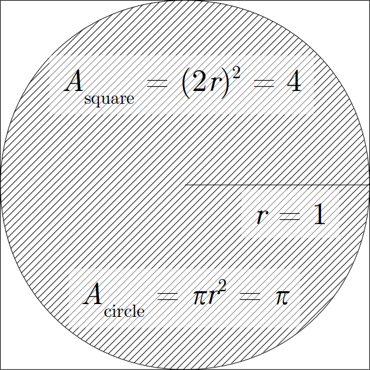
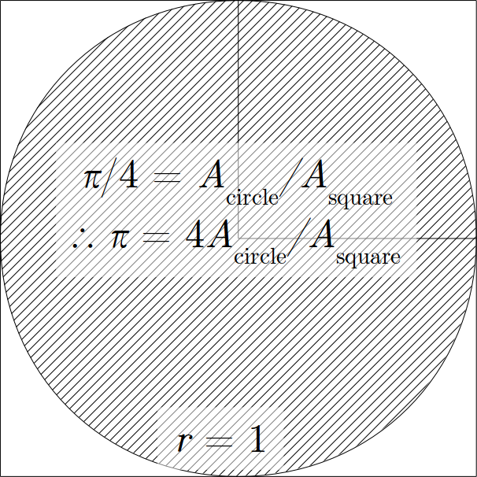
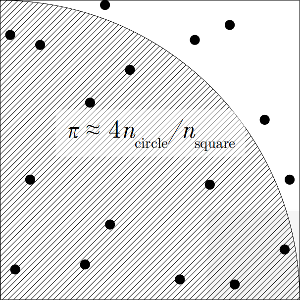

#   Lesson 6:  Monte Carlo simulation

---

### Contents

-   [Monte Carlo simulation](#1)
-   [Sampling](#2)
-   [Applications](#3)
-   [Contributors](#6)

---

First, a standard header to load necessary libraries:

    import numpy as np
    from numpy import random as npr
    import matplotlib.pyplot as plt
    %matplotlib inline

##  [Monte Carlo simulation](#1)

Monte Carlo techniques are used to estimate quantities by random sampling.  They are particularly useful in three cases (arranged in order of approximate complexity):

1.  Numerical integration (particularly high-dimensional integrals)
2.  Kinetic Monte Carlo (sampling events based on likelihoods)
3.  Markov chain Monte Carlo (MCMC), including the [Metropolis algorithm](https://infogalactic.com/info/Metropolis%E2%80%93Hastings_algorithm) (targeted physics simulations)
    > The Metropolis–Hastings algorithm can draw samples from any probability distribution P(x), provided you can compute the value of a function f(x) which is proportional to the density of P. The lax requirement that f(x) should be merely proportional to the density, rather than exactly equal to it, makes the Metropolis–Hastings algorithm particularly useful, because calculating the necessary normalization factor is often extremely difficult in practice.

Monte Carlo methods can be intuitively demonstrated.  First, we will estimate the value of $\pi$.  This algorithm essentially involves throwing darts at a circle and comparing the number of hits to the overall area thus:

Implemented in Python, this algorithm only requires a few lines:

    def pi_calc( n_square ):
        xy = npr.rand( n_square,2 )
        radii = np.sqrt( xy[ :,0 ]*xy[ :,0 ] + xy[ :,1 ]*xy[ :,1 ] )
        n_circle = len( radii[ radii <= 1.0 ] )
        pi_approx = 4 * n_circle / n_square
        return pi_approx
    n = 100
    pi_approx = pi_calc( n )
    print( '%i samples yields:\t%f' % ( n,pi_approx ) )

The following version performs estimates over a battery of sample sizes:

    sampleList = np.logspace( 1,7,10 )
    pis = []
    for n in sampleList:
        pis.append( pi_calc( n ) )

    fig,ax = plt.subplots()
    ax.loglog( sampleList,pis,'bo' )
    ax.plot( [ 10,10**7 ],[ np.pi,np.pi ],'b-' )
    plt.show()

For comparison, let's calculate the value of $\pi$ using the Leibniz series

$$
\frac{\pi}{4}
=
\sum_{n=0}^\infty
\,
\frac{(-1)^n}{2n+1}
$$

and compare the timing:

    def pi_series( n ):
        pi_approx = 0
        for i in range( n ):
            pi_approx += ( -1 ) ** i / ( 2*i + 1 )
        return pi_approx*4

    %timeit pi_calc( 10000 )
    %timeit pi_series( 10000 )

Of course, that's not yet to comparable accuracy, so let's improve on that:

    error = abs( np.pi - pi_series( 10000 ) )
    err = 1
    n = 100
    while err > error:
        err = abs( np.pi - pi_calc( n ) )
        n *= 2

    %timeit pi_calc( n )
    %timeit pi_series( 10000 )

Now this application is ludicrously slow to converge, but Monte Carlo techniques are quite useful in spaces too large to characterize, such as configuration spaces in thermodynamics or physics.  In particular, problems involving [highly-dimensional](https://www.johndcook.com/blog/2015/07/19/high-dimensional-integration/) configuration spaces or integrals favour a Monte Carlo approach.

### $n$-dimensional integration

Let's flip the problem now:  given an $n$-sphere, find its volume.  Use $m = 20$ samples:  the midpoint (rectangular) method to integrate, and the Monte Carlo method to sample.  Compare the two methods.  We consider a method to have converged when the volume is within 1% of the actual volume.

    rtol = 0.01  # 1% permissible error rate

    def unitSphere( *X ):  # *X can take a variable number of arguments, tuple
        X = np.array( X )
        r = np.sqrt( np.sum( X ** 2 ) )
        return 1 if r < 1.0 else 0
    unitSphere = np.vectorize( unitSphere )

**Analytical Volume**

> In general, the volume, in $n$-dimensional Euclidean space, of the unit $n$-ball, is given by

$$
V_n
=
\frac{\pi^\frac{n}{2}}{\Gamma(\frac{n}{2} + 1)}
\text{.}
$$

    from numpy import pi
    from scipy.special import gamma

    # analytical solution, r = 1
    def vol_ana( k ):
        return pi ** ( 0.5*k ) / gamma( 0.5*k + 1 )

(As an aside, why bother with `0.5*k` instead of `k/2`?  It used to be that computers didn't optimize around division as well, so those processes were always slower in numerical applications.  Even today it may make a slight difference:

    %timeit 4/3*pi
    %timeit 4*0.333*pi
)

**Numerical Volume (Riemann/Midpoint Integration)**

> The Riemann sum is perhaps the simplest and most intuitive numerical integration scheme. You want to integrate a function on an interval of length $x$. Divide your interval into $N$ sub-intervals of equal length $\Delta x = L/N$. Evaluate the function in the middle of each sub-interval. The contribution to the total area from a sub-interval with midpoint $x_i$ is then $f(x_i)\Delta x$, and the total value of the integral is

$$
\Delta x
\sum_{i=1}^{N}
f( x_i )
\text{.}
$$

> The generalisation to $D$ dimensions is straightforward. Instead of having $N$ equally spaced points along a line, you create a $D$-dimensional grid of points, with equal spacing, $\Delta x$, in all dimensions. The contribution
to the total integral from a volume with center $\vec{x}_i$ is $f(\vec{x}_i) \cdot \Delta x ^ D$.  ([ref](http://amokk.phys.ntnu.no/files/TFY4235_2016/documents/MC_Integration_in_D_dimensions.pdf))

    # volumetric integration, midpoint method, generalized formula
    # We'll calculate for one quadrant/octant/etc. and multiply by 2**k.

    def int_midpoint( f,        # function to integrate
                      nx,       # number of points along regular grid in dims
                      k,        # total dimensionality of ball (k-ball)
                      xmin=0.,  # start of integration interval
                      xmax=1.   # end of integration interval
                    ):
        dx = ( xmax - xmin ) / nx
        x = np.linspace( xmin+0.5*dx,xmax-0.5*dx,nx )
        vol = dx ** k

        # Set up regular grid of points.
        #  pts = [ x ] in k=1 since meshgrid doesn't work in 1D
        pts = np.array( np.meshgrid( *[x]*k ) ).reshape( k,-1 )

        return np.sum( f( *pts ) ) * vol * ( 2**k )

    int_midpoint( unitSphere,100,3 )

**Numerical Volume (Monte Carlo Integration)**

    # Monte Carlo integration, generalized formula

    def int_mc( f,        # function to integrate
                ns,       # number of points to sample
                k,        # total dimensionality of ball (k-ball)
                xmin=0.,  # start of integration interval
                xmax=1.   # end of integration interval
              ):
        vol = ( xmax - xmin ) / ns  # total int. vol. / num. pts
        pts = npr.random( ( k,ns ) ) * ( xmax - xmin ) + xmin

        return np.sum( f( *pts ) ) * vol * ( 2**k )

    int_mc( unitSphere,100,3 )

-   As we increase the dimensionality of the ball, does this stochastic method become more efficient numerically than the corresponding series solution?  Write a Python program to test this for dimensions from 2 to 25.  Include timing data.

> To be more specific about the cumbersomeness, for numerical integration we will always need at least a few points $N_i$ per dimension to get a sensible answer, so the number of summing steps increases as $N_i^M$.
> If *e.g.* $N_i = 5$ for all $i$ (a very low value!), then in 10 dimensions we need $5^10 \approx 10^6$ points to get any kind of sensible answer.
> But for MC integration we can use the same number of points $N$ for any number of dimensions.  ([Nordlund2006](http://beam.acclab.helsinki.fi/~knordlun/mc/mc5nc.pdf))

---

##  [Sampling](#2)

Monte Carlo algorithms allow you to control the sampling; in other words, *which random distribution* the samples are taken from.  Sometimes it makes sense to use a Gaussian or power-law distribution, or simply to partition the space being sampled in an intelligent way to optimize the convergence.

The goal, in cases like this, is to outline the behavior of the system and its properties without needing to exhaustively consult the entire data set.  Thus sampling is critically important in very large data sets, where I define "very large" as "not fitting in RAM".

One such method, the [Latin hypercube](https://infogalactic.com/info/Latin_hypercube_sampling), is implemented as follows.  (A Latin square is a square containing only one sample in each row and each column.  Latin hypercube sampling generates plausible samples from multivariate distributions.)

    dim = 4;    # dimensionality of Latin hypercube
    n = 160;    # number of samples

    nPerCell = n / ( dim ** 2 )
    nPerRow  = n / dim

    xy = np.zeros( ( n,2 ) )

    for i in range( dim ):
        for j in range( dim ):
            indices = list( range( int( i * nPerRow + j * nPerCell ),int( i * nPerRow + ( j+1 ) * nPerCell ) ) )
            print( indices )
            for index in indices:
                xy[ index,0 ] = npr.rand() / dim + i / dim
                xy[ index,1 ] = npr.rand() / dim + j / dim

    radii = np.sqrt( xy[ :,0 ]*xy[ :,0 ] + xy[ :,1 ]*xy[ :,1 ] )
    n_circle = len( radii[ radii <= 1.0 ] )
    pi_approx = 4 * n_circle / n
    print( '%i samples yields:\t%f' % ( n,pi_approx ) )

-   Quantify the error rate and convergence on the standard and the Latin hypercube methods.

---

##  [Applications](#3)

Thus far, what we have done is demonstrate the technique with a limited scope of application.  Monte Carlo approaches are valuable with extremely large data sets or for high-throughput data sets such as trading analysis and prediction and scientific experimentation (CERN, LSST).  (In the latter case, MC can be related to compressed sensing for reconstruction of the underlying system.)

Monte Carlo methods stack well with other data mining and machine learning algorithms.  For instance, _Monte Carlo cross-validation_ splits data randomly between learning sets and test sets to verify the error rates across many possible samples.

-   Implement MC cross-validation against $k$-nearest neighbors using the `data_wine_complete.csv` data set.

Finally, there are subtle considerations to take into account when carrying out Monte Carlo methods on a computer.  For instance, computers do not generate true random numbers, but pseudo-random numbers.  Thus the RNG must not exhibit high-dimensional clustering or the sampling may be biased, compromising the simulation.

---

##  [Contributors](#6)

These lessons were developed by Erhu Du, Jane Lee, and Neal Davis for Computational Science and Engineering at the University of Illinois.  Development was supported by a grant from MathWorks, Inc.
