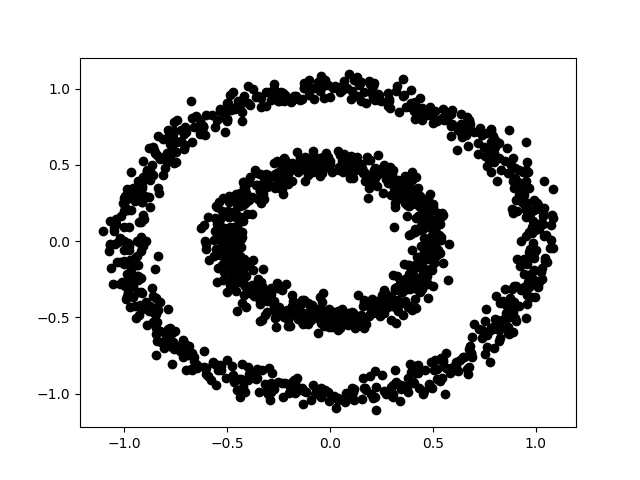
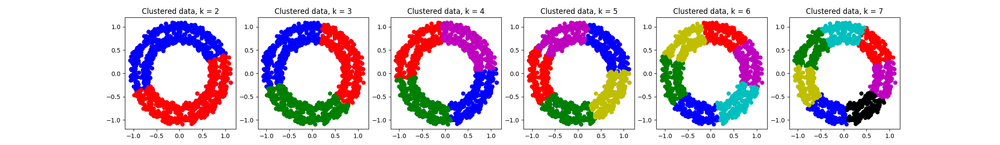

#   Lesson 8:  Hierarchical Clustering

---

### Contents

-   [Introduction](#1)
-   [Hierarchical clustering method](#3)
-   [Dendrograms](#4)
-   [Evaluation:  silhouette method](#5)
-   [Contributors](#6)

---

First, a standard header to load necessary libraries:

    import numpy as np
    from numpy import random as npr
    import matplotlib.pyplot as plt
    import matplotlib.cm as cm
    %matplotlib inline

##  [Introduction](#1)

How many clusters does the following data set have?

    from sklearn.datasets import make_circles

    noisy_circles = make_circles( n_samples=1500,factor=0.5,noise=0.05 )
    plt.plot( noisy_circles[ 0 ][ :,0 ],noisy_circles[ 0 ][ :,1 ],'ko' )
    plt.show()

KMC has a rough time with this example; using the silhouette metric, the best fit indicated has a score of 0.45 with five clusters; absolute junk!

    from sklearn.cluster import KMeans

    ks = [ 2,3,4,5,6,7 ]
    labels = []
    for k in ks:
        est = KMeans( n_clusters=k )
        est.fit( noisy_circles[ 0 ] )
        labels.append( est.labels_ )

    for k in ks:
        colors = [ 'bo','ro','go','mo','yo','co','ko' ]
        plt.subplot( 1,6,k-1 )
        for i in range( k ):
            data = noisy_circles[ 0 ][ labels[ k-2 ] == i ]
            plt.plot( data[ :,0 ],data[ :,1 ],colors[ i ] )
        plt.title( 'Clustered data, k = %i'%k )
    plt.show()

    ###

    from sklearn.metrics import silhouette_samples, silhouette_score

    k_candidates = list( range( 2,8 ) )
    s_values = np.zeros( ( len( k_candidates ),1 ) )

    fig,axes = plt.subplots( 2,len( k_candidates ) )
    for k in k_candidates:
        # silhouette plot
        axes[ 0,k-2 ].set_xlim( [ -1,1 ] )
        axes[ 0,k-2 ].set_ylim( [ 0,len( noisy_circles[ 0 ] )+( k+1 )*10 ] )

        est = KMeans( n_clusters=k )
        C_labels = est.fit_predict( noisy_circles[ 0 ] )

        # average silhouette score per k
        silhouette_avg = silhouette_score( noisy_circles[ 0 ],C_labels )
        print( "k = %d yields average silhouette_score = %f."%( k,silhouette_avg ) )

        # silhouette scores for each sample
        sample_silhouette_values = silhouette_samples( noisy_circles[ 0 ],C_labels )

        ## plot of silhouette scores
        y_lower = 10
        for i in range( k ):
            # aggregate silhouette scores for samples in cluster i
            ith_cluster_silhouette_values = sample_silhouette_values[ C_labels == i ]
            ith_cluster_silhouette_values.sort()

            size_cluster_i = ith_cluster_silhouette_values.shape[ 0 ]
            y_upper = y_lower + size_cluster_i

            color = cm.spectral( float( i ) / k )
            axes[ 0,k-2 ].fill_betweenx( np.arange( y_lower,y_upper ),0,ith_cluster_silhouette_values,facecolor=color,edgecolor=color,alpha=0.7 )

            # label by cluster number
            axes[ 0,k-2 ].text(-0.05, y_lower + 0.5 * size_cluster_i, str(i))

            # compute y_lower for next plot
            y_lower = y_upper + 10  # 10 for the 0 samples

        # average silhouette score as vertical line
        axes[ 0,k-2 ].axvline( x=silhouette_avg,color='red',linestyle='--' )

        axes[ 0,k-2 ].set_yticks( [] )    # clear y-axis labels/ticks
        axes[ 0,k-2 ].set_xticks( np.linspace( -1,1,11 ) )

        ## plot of clusters
        colors = cm.spectral( C_labels.astype( float ) / k )
        axes[ 1,k-2 ].scatter( noisy_circles[ 0 ][ :,0 ],noisy_circles[ 0 ][ :,1 ],marker='.',s=30,lw=0,alpha=0.7,c=colors )

        # label clusters with white circles and numbers
        centers = est.cluster_centers_
        axes[ 1,k-2 ].scatter( centers[ :,0 ],centers[ :,1 ],marker='o',c="white",alpha=1,s=200 )
        for i,c in enumerate( centers ):
            axes[ 1,k-2 ].scatter( c[ 0 ],c[ 1 ],marker='$%d$'%i,alpha=1,s=50 )
    plt.show()

-   How would we seed the above example with suitable cluster centroids?

[Hierarchical clustering](https://infogalactic.com/info/Hierarchical_clustering) is used to build a hierarchy of clusters, from both a bottom-up (*agglomerative*) approach and a top-down (*divisive*) approach.  Because of an internal tree-like structure, HCA can often handle clusters which are visually (or conceptually) identifiable but not amenable to traditional single-level clustering analysis.  In this section, we will use agglomerative clustering to build a model which can handle data sets with "odd" features, like the above example.

As before, we will generate a clean random data set to demonstrate the technique initially.  (This process is identical to that used for the $k$-means clustering lesson.)

    k = 3       # number of clusters
    n = 50      # number of points per cluster

    sigma = 0.2 # stdevs of clusters
    centers = [ ( 0,1 ),( 1,0 ),( -0.5,-0.5 ) ]

    samples = np.zeros( ( k*n,2 ) )
    for index,center in enumerate( centers ):
        samples[ index*n:( index+1 )*n,: ] = npr.randn( n,2 ) * sigma + center

    fig,ax = plt.subplots()
    for index,mrkr in enumerate( [ 'bo','ro','go' ] ):
        data = samples[ index*n:( index+1 )*n,: ]
        ax.plot( data[ :,0 ],data[ :,1 ],mrkr )
    plt.title( 'Original Data' )
    plt.show()

    fig,ax = plt.subplots()
    plt.plot( samples[ :,0 ],samples[ :,1 ],'ko' )
    plt.title( 'Original Data' )
    plt.show()

---

##  [Hierarchical clustering method][#3]

Hierarchical clustering is provided by `scikit-learn`:

    from sklearn.cluster import AgglomerativeClustering

    k = 3
    est = AgglomerativeClustering( n_clusters=k,linkage='ward' )
    C = est.fit( samples )
    labels = C.labels_

    fig,ax = plt.subplots()
    colors = [ 'bo','ro','go','mo','yo','co','ko' ]
    for i in range( k ):
        data = samples[ labels == i ]
        ax.plot( data[ :,0 ],data[ :,1 ],colors[ i ] )
    plt.title( 'Clustered data, k = %i'%k )
    plt.show()

-   Compare the outcomes from KMC and HCA for the same $k$ clusters.

-   How do we fit our `noisy_circles` example from above?

        k = 2
        est = AgglomerativeClustering( n_clusters=k,linkage='average',affinity='cityblock' )
        labels = est.fit_predict( noisy_circles[ 0 ] )

        fig,ax = plt.subplots()
        data0 = noisy_circles[ 0 ][ labels == 0 ]
        ax.plot( data0[ :,0 ],data0[ :,1 ],'bo' )
        data1 = noisy_circles[ 0 ][ labels == 1 ]
        ax.plot( data1[ :,0 ],data1[ :,1 ],'ro' )
        plt.title( 'Clustered data, k = %i'%k )
        plt.show()

    That's no good!  We need connectivity information.

Since hierarchical clustering methods are built in to `scikit-learn`, we'll spend more time exploring parameters than the initial construction.

**Connectivity constraints**.  If we have some information available about how close various samples are within the entire data set (i.e., do they occur in sheets or balls), we can utilize this to constrain the system to find better fits.  An example [from the `scikit-learn` documentation](http://scikit-learn.org/stable/auto_examples/cluster/plot_ward_structured_vs_unstructured.html):

    import time as time
    import numpy as np
    import matplotlib.pyplot as plt
    import mpl_toolkits.mplot3d.axes3d as p3
    from sklearn.cluster import AgglomerativeClustering
    from sklearn.datasets.samples_generator import make_swiss_roll

    # Generate data (swiss roll dataset)
    n_samples = 1500
    noise = 0.05
    X, _ = make_swiss_roll(n_samples, noise)
    # Make it thinner
    X[:, 1] *= .5

    # Compute clustering
    print("Compute unstructured hierarchical clustering...")
    st = time.time()
    ward = AgglomerativeClustering(n_clusters=6, linkage='ward').fit(X)
    elapsed_time = time.time() - st
    label = ward.labels_
    print("Elapsed time: %.2fs" % elapsed_time)
    print("Number of points: %i" % label.size)

    # Plot result
    fig = plt.figure()
    ax = p3.Axes3D(fig)
    ax.view_init(7, -80)
    for l in np.unique(label):
        ax.plot3D( X[label == l, 0], X[label == l, 1], X[label == l, 2],
                   'o', color=plt.cm.jet(np.float(l) / np.max(label + 1)) )
    plt.title('Without connectivity constraints (time %.2fs)' % elapsed_time)
    plt.show()

    ###

    # Define the structure A of the data. Here a 10 nearest neighbors
    from sklearn.neighbors import kneighbors_graph
    connectivity = kneighbors_graph(X, n_neighbors=10, include_self=False)

    # Compute clustering
    print("Compute structured hierarchical clustering...")
    st = time.time()
    ward = AgglomerativeClustering(n_clusters=6, connectivity=connectivity,
                                   linkage='ward').fit(X)
    elapsed_time = time.time() - st
    label = ward.labels_
    print("Elapsed time: %.2fs" % elapsed_time)
    print("Number of points: %i" % label.size)

    # Plot result
    fig = plt.figure()
    ax = p3.Axes3D(fig)
    ax.view_init(7, -80)
    for l in np.unique(label):
        ax.plot3D(X[label == l, 0], X[label == l, 1], X[label == l, 2],
                  'o', color=plt.cm.jet(float(l) / np.max(label + 1)))
    plt.title('With connectivity constraints (time %.2fs)' % elapsed_time)
    plt.show()

**Linkages**.  Linkage describes how the distances between sets of samples is determined.  Three common linkages are supported by `AgglomerativeClustering` in `scikit-learn`:

    - `ward` minimizes the variance of the clusters being merged.
    - `average` uses the average of the distances of each observation of the two sets.
    - `complete` or maximum linkage uses the maximum distances between all observations of the two sets.

-   Finish the `noisy_circles` example from above.

        from sklearn.neighbors import kneighbors_graph

        # connectivity matrix of structure
        connectivity = kneighbors_graph( noisy_circles[ 0 ],n_neighbors=10,include_self=False )
        connectivity = 0.5 * (connectivity + connectivity.T)

        k = 2
        est = AgglomerativeClustering( n_clusters=k,linkage='average',affinity='cityblock',connectivity=connectivity )
        labels = est.fit_predict( noisy_circles[ 0 ] )

        fig,ax = plt.subplots()
        data0 = noisy_circles[ 0 ][ labels == 0 ]
        ax.plot( data0[ :,0 ],data0[ :,1 ],'bo' )
        data1 = noisy_circles[ 0 ][ labels == 1 ]
        ax.plot( data1[ :,0 ],data1[ :,1 ],'ro' )
        plt.title( 'Clustered data, k = %i'%k )
        plt.show()

        ###

        ks = [ 2,3,4,5,6,7 ]
        labels = []
        for k in ks:
            est = AgglomerativeClustering( n_clusters=k,linkage='average',affinity='cityblock',connectivity=connectivity )
            labels.append( est.fit_predict( noisy_circles[ 0 ] ) )

        for k in ks:
            colors = [ 'bo','ro','go','mo','yo','co','ko' ]
            plt.subplot( 1,6,k-1 )
            for i in range( k ):
                data = noisy_circles[ 0 ][ labels[ k-2 ] == i ]
                plt.plot( data[ :,0 ],data[ :,1 ],colors[ i ] )
            plt.title( 'Clustered data, k = %i'%k )
        plt.show()

        Note how much better HCA performs when it comes to overestimating the number of necessary clusters; having a lot of small clusters could serve as an informal metric for higher-dimensional spaces.

The [`scikit-learn documentation`](http://scikit-learn.org/stable/modules/clustering.html#hierarchical-clustering) illustrates more examples of hierarchical clustering.

-   What sort of metric will perform well for HCA?

---

##  [Dendrograms](#4)

> This segment follows [Jörn Hees' tutorial](https://joernhees.de/blog/2015/08/26/scipy-hierarchical-clustering-and-dendrogram-tutorial/).

Connectivity trees are often depicted using *dendrograms*.  In order to visualize these, we will take a slightly circuitous route to calculating the HCA via the [linkage](https://docs.scipy.org/doc/scipy/reference/generated/scipy.cluster.hierarchy.linkage.html) instead.

    from scipy.cluster.hierarchy import dendrogram, linkage

    Z = linkage( noisy_circles[ 0 ],'ward' )

    plt.figure( figsize=( 25,10 ) )
    plt.title( 'Hierarchical Clustering Dendrogram' )
    plt.xlabel( 'sample index' )
    plt.ylabel( 'distance' )
    dendrogram( Z,leaf_rotation=90.,leaf_font_size=8. )
    plt.show()

Unfortunately, there isn't an easy way to relate the `scipy` linkage used here to the `scikit-learn` method used previously in this section.

---

##  [Evaluation:  silhouette method](#5)

We will use the silhouette method with the `noisy_circles` data set as an example.

    from sklearn.metrics import silhouette_samples, silhouette_score

    ks = [ 2,3,4,5,6,7 ]
    s_values = np.zeros( ( len( ks ),1 ) )

    fig,axes = plt.subplots( 2,len( ks ) )
    for k in ks:
        # silhouette plot
        axes[ 0,k-2 ].set_xlim( [ -1,1 ] )
        axes[ 0,k-2 ].set_ylim( [ 0,len( noisy_circles[ 0 ] )+( k+1 )*10 ] )

        est = AgglomerativeClustering( n_clusters=k,linkage='average',affinity='cityblock',connectivity=connectivity )
        labels = est.fit_predict( noisy_circles[ 0 ] )

        # average silhouette score per k
        silhouette_avg = silhouette_score( noisy_circles[ 0 ],labels )
        print( "k = %d yields average silhouette_score = %f."%( k,silhouette_avg ) )

        # silhouette scores for each sample
        sample_silhouette_values = silhouette_samples( noisy_circles[ 0 ],labels )

        ## plot of silhouette scores
        y_lower = 10
        for i in range( k ):
            # aggregate silhouette scores for samples in cluster i
            ith_cluster_silhouette_values = sample_silhouette_values[ labels == i ]
            ith_cluster_silhouette_values.sort()

            size_cluster_i = ith_cluster_silhouette_values.shape[ 0 ]
            y_upper = y_lower + size_cluster_i

            color = cm.spectral( float( i ) / k )
            axes[ 0,k-2 ].fill_betweenx( np.arange( y_lower,y_upper ),0,ith_cluster_silhouette_values,facecolor=color,edgecolor=color,alpha=0.7 )

            # label by cluster number
            axes[ 0,k-2 ].text(-0.05, y_lower + 0.5 * size_cluster_i, str(i))

            # compute y_lower for next plot
            y_lower = y_upper + 10  # 10 for the 0 samples

        # average silhouette score as vertical line
        axes[ 0,k-2 ].axvline( x=silhouette_avg,color='red',linestyle='--' )

        axes[ 0,k-2 ].set_yticks( [] )    # clear y-axis labels/ticks
        axes[ 0,k-2 ].set_xticks( np.linspace( -1,1,11 ) )

        ## plot of clusters
        colors = cm.spectral( labels.astype( float ) / k )
        axes[ 1,k-2 ].scatter( noisy_circles[ 0 ][ :,0 ],noisy_circles[ 0 ][ :,1 ],marker='.',s=30,lw=0,alpha=0.7,c=colors )
    plt.show()

-   Implement an assessment of the clusters using the gap statistic method.

-   Pull the iris data set back up and cluster for different parameters to suggest natural groupings of irises.  How would you assess the suitability of such groupings?

-   Examine the satellite data $k$-means clustering example in `satellite.ipynb` again.  Does HCA perform "better" for cases similar to those you examined before?

---

##  [Contributors](#6)

These lessons were developed by Erhu Du, Jane Lee, and Neal Davis for Computational Science and Engineering at the University of Illinois.  Development was supported by a grant from MathWorks, Inc.
